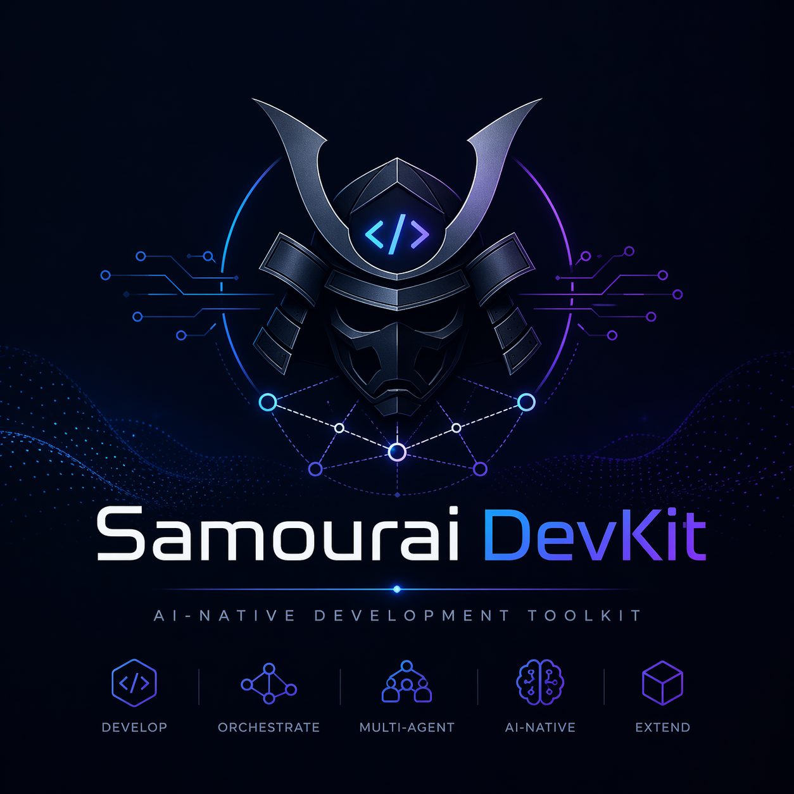

# Samourai Devkit — AI Development Operating System

<p align="center">
  
</p>

---

# 🧭 Quick Navigation

- 📘 User guide: [docs/user-guide.md](docs/user-guide.md)
- 🧱 Templates: [core/templates/README.md](core/templates/README.md)
- 🏗️ Project onboarding: [core/governance/conventions/onboarding-existing-project.md](core/governance/conventions/onboarding-existing-project.md)
- 🔁 Lifecycle: [core/governance/conventions/change-lifecycle.md](core/governance/conventions/change-lifecycle.md)
- 🤖 Agents & commands: [core/governance/conventions/opencode-agents-and-commands-guide.md](core/governance/conventions/opencode-agents-and-commands-guide.md)

---

# 🧭 Positioning

Samourai Devkit is an **AI Development Operating System** that transforms a Git repository into a structured development environment driven by specialized AI agents.

---

# 🎯 Problem Statement

AI-assisted development suffers from:

- unpredictable output quality
- lack of workflow structure
- duplicated prompts
- absence of governance

Samourai Devkit provides:

- ✅ A deterministic workflow
- ✅ Specialized, orchestrated agents
- ✅ Built-in governance
- ✅ Standardization via blueprints

---
---

## 🔁 Standard Workflow

1. Analysis → `/analyze-user-stories`
2. Scoping → `/plan-change`
3. Specification → `/write-spec`
4. Test design → `/write-test-plan`
5. Implementation → `/run-plan`
6. Gap analysis → `/gap-analysis`
7. Review → `/review`
8. Verification → `/check`
9. Verdict → `/verdict`
10. Documentation → `/sync-docs`
11. Delivery → `/commit` → `/pr`

---

# 🧩 Blueprints (Structural Element)

Blueprints provide standardization for:

- workflows
- documents
- agent behavior
- test and review strategies

### Usage

Blueprints are automatically used by:

- `/bootstrap`
- `/write-spec`
- `/review`
- `/pr`
- `@toolsmith`

👉 They industrialize agent usage and reduce output variability.

---

# 🏗️ Architecture

1. Interaction
2. Orchestration
3. Agents
4. Skills / Tools
5. Context / Memory
6. Governance

---

## ⚙️ Quick Install

```bash
curl -fsSL https://raw.githubusercontent.com/FR-PAR-SAMOUR-AI/samourai-devkit/main/scripts/install-remote.sh | bash -s -- --target /path/to/project
```

### Local installation after git clone

To keep a local copy of the kit, clone the repository then run the install
script from that copy:

```bash
git clone https://github.com/FR-PAR-SAMOUR-AI/samourai-devkit.git
cd samourai-devkit
./scripts/install-samourai.sh --target /path/to/my-project
```

The path passed to `--target` must point to the Git project into which
Samourai Devkit should be installed, not to the `samourai-devkit` repository
itself.

### Guided installation

```bash
./scripts/install-samourai.sh --interactive
```


### Installation into a local project

From this repo:

```bash
./scripts/install-samourai.sh --target /path/to/my-project
```
---
Useful options:

```bash
./scripts/install-samourai.sh --target /path/to/project --dry-run
./scripts/install-samourai.sh --target /path/to/project --force
./scripts/install-samourai.sh --target /path/to/project --skip-opencode
./scripts/install-samourai.sh --target /path/to/project --editor opencode
./scripts/install-samourai.sh --target /path/to/project --editor vscode
./scripts/install-samourai.sh --target /path/to/project --editor opencode,vscode
./scripts/install-samourai.sh --target /path/to/project --editor all
./scripts/install-samourai.sh --target /path/to/project --symlink-stack

```

### Symlink-stack installation

To keep `.opencode`, `.samourai` and `AGENTS.md` outside the client repository
while still making them visible to OpenCode, use:

```bash
./scripts/install-samourai.sh --target /path/to/client-project --symlink-stack
```

The script installs the stack into a sibling folder named:

```text
/path/to/client-project-samurai
```

It then creates symbolic links inside the client project. `AGENTS.md` is linked
only if it already exists or has been migrated to the stack:

```text
.opencode -> ../client-project-samurai/.opencode
.samourai -> ../client-project-samurai/.samourai
AGENTS.md -> ../client-project-samurai/AGENTS.md
```

The links are added to `.git/info/exclude`, so they remain local to the clone
and are not proposed for commit in the client repository. The stack can be
versioned and pushed from the `client-project-samurai` repository.

## Uninstalling the kit

```bash
./scripts/uninstall-samourai.sh --target /path/to/my-project
```

OpenCode adapter:

- `.opencode/README.md`
- `.opencode/.gitignore`
- `.opencode/opencode.jsonc`
- `.opencode/agent/*.md`
- `.opencode/command/*.md`
- `.opencode/skills/*/SKILL.md`
- `.opencode/skills/project/README.md`

VS Code/GitHub Copilot adapter:

- `.github/copilot-instructions.md`
- `.github/agents/*.agent.md`
- `.github/prompts/*.prompt.md`
- `.github/skills/*/SKILL.md`
- `.vscode/extensions.json`
- `.vscode/mcp.json`
- `.vscode/settings.json`

## ⚡ Quick Start (2 min)

1. Install the kit
2. Open the project in OpenCode or VS Code
3. Run:

```bash
/bootstrap
```

4. Then:

```bash
/plan-change JIRA-123
```

---

## 🧠 What Changes in Practice

Before:
- Manual development
- Ad hoc prompts
- Inconsistent results

After:
- Structured workflow
- Specialized agents
- Standardized outputs
- Built-in governance

---

# 🔐 Governance

- Agent permissions
- Side-effect control
- Validation before commit / PR
- Auditability

---


## 🏢 Scalability

Samourai Devkit enables:

- Multi-team standardization
- Pattern reuse
- Accelerated delivery
- Reduction of human errors

---


# 📘 Getting Started (official documentation)

1. Read: [docs/user-guide.md](docs/user-guide.md)
2. Read: [core/governance/conventions/onboarding-existing-project.md](core/governance/conventions/onboarding-existing-project.md)
3. Read: [core/governance/conventions/change-lifecycle.md](core/governance/conventions/change-lifecycle.md)
4. Refer to: [core/templates/README.md](core/templates/README.md)
5. Install, then run /bootstrap
